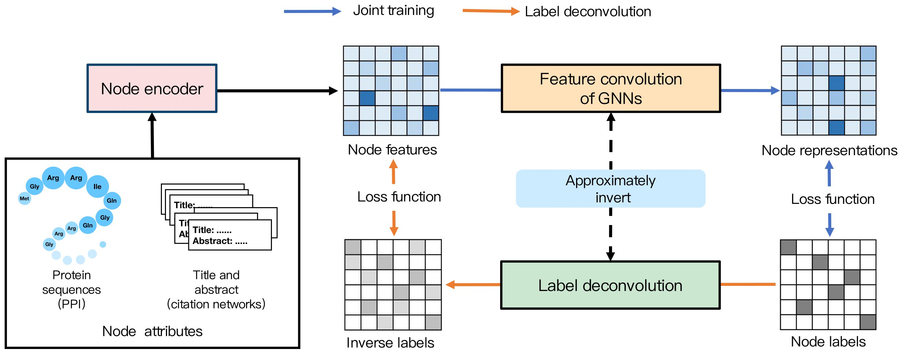

# Label Deconvolution for Node Representation Learning on Large-scale Attributed Graphs against Learning Bias

This repository is an implementation of **LD**. [arxiv](http://arxiv.org/abs/2309.14907)

## Overview

We propose an efficient and effective label regularization technique, namely Label Deconvolution (LD), to alleviate the learning bias from that by the joint training.



## Requirements

The core packages are as follows.

- python=3.8
- ogb=1.3.3
- numpy=1.19.5
- dgl=0.8.0
- pytorch=1.10.2
- pyg=2.0.3
- hydra-core==1.3.1

To use our exact environment, one may install the environment by the following command:
```
conda env create -f environment.yml
```


## Results:

Performance on **ogbn-arxiv**(5 runs):
| Methods                           | Validation accuracy | Test accuracy |
| --------------------------------- | ------------------- | ------------- |
| $\mathbf{X}_{\text{LD}}$ + GCN    | 76.84 ± 0.09        | 76.22 ± 0.10  |
| $\mathbf{X}_{\text{LD}}$ + RevGAT | 77.62 ± 0.08        | 77.26 ± 0.17  |

Performance on **ogbn-products**(5 runs):
| Methods                          | Validation accuracy | Test accuracy |
| -------------------------------- | ------------------- | ------------- |
| $\mathbf{X}_{\text{LD}}$ + GAMLP | 94.15 ± 0.03        | 86.45± 0.12   |
| $\mathbf{X}_{\text{LD}}$ + SAGN  | 93.99 ± 0.02        | 87.18 ± 0.04  |

Performance on **ogbn-protein**(5 runs):
| Methods                        | Validation accuracy | Test accuracy |
| ------------------------------ | ------------------- | ------------- |
| $\mathbf{X}_{\text{LD}}$ + GAT | 95.27 ± 0.07        | 89.42 ± 0.07  |

## Extracted Node Features

We provide extracted node features for each dataset at [Features](https://drive.google.com/drive/folders/109GHk4dtDf0hX_kQLDeMfnvz0Bo5aq_k?usp=drive_link).

## Running the code

### Preparing Data and Pre-trained Models

Before starting the training process, there are certain preparations that need to be done.s

1. Generate tokens from the original node attributes following [GLEM](https://github.com/AndyJZhao/GLEM) and the "protein" folder. For convenience, we provide the LM token of each dataset at [Token](https://drive.google.com/drive/folders/107wQOd2YWyWofvPixWjM7YnTgaXUPGuR?usp=drive_link). The tokenizers are from the following pre-trained models in Huggingface.
   - **ogbn-arxiv**: deberta-base (REVGAT)

   - **ogbn-products**: deberta-base (GAMLP) and bert-base-uncased (SAGN)

   - **ogbn-proteins**: esm2-t33-650M-UR50D (GAT)
2. Download the LM corresponding to each dataset from the Hugging Face official website.
3. Modify the `path` and `token_folder` values in the `transformer/conf/LM/*.yaml` folder.


### Training


#### Dataset: ogbn-arxiv

- REVGAT:

```
cd transformer
bash scripts/shell_arxiv_revgat.sh
```

#### **ogbn-products**

- GAMLP

```
cd transformer
bash scripts/shell_product_gamlp.sh
```

- SAGN

```
cd transformer
bash scripts/shell_product_sagn.sh
```

#### **ogbn-protein**

- GAT

```
cd transformer
bash scripts/shell_protein_gat.sh
```
